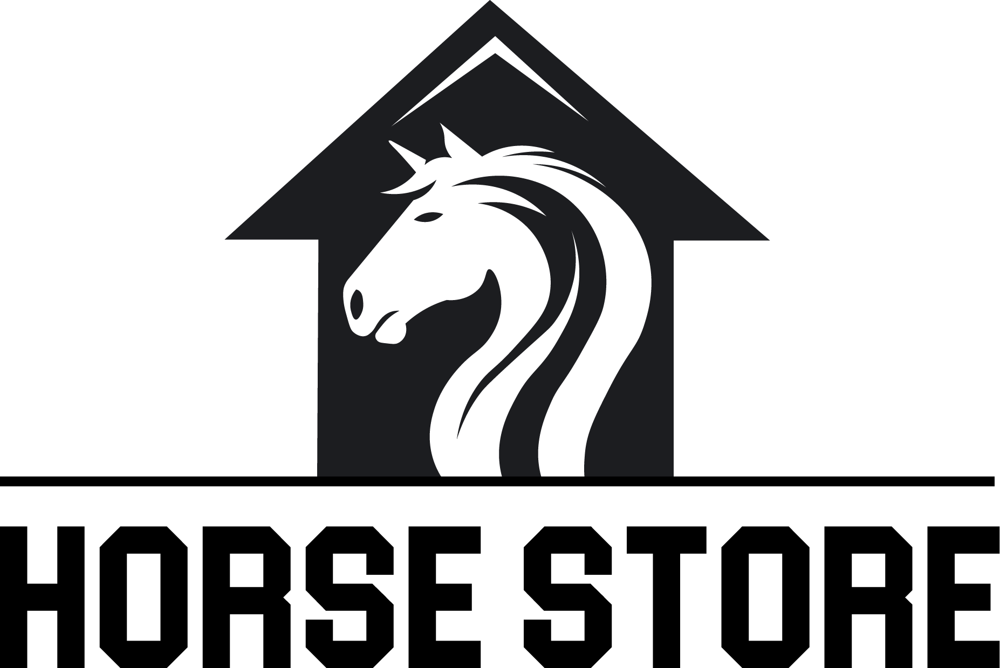

# Assembly, EVM Opcodes, and Formal Verification

Welcome to the repository for the Assembly, EVM Opcodes, and Formal Verification Course by Cyfrin Updraft!

This repository houses the written content of our courses, organized to facilitate easy access and contribution from our community.
Please refer to this for an in-depth explanation of the content:

-   [Website](https://updraft.cyfrin.io/) - Join Cyfrin Updraft and enjoy 50+ hours of smart contract development courses
-   [Twitter](https://twitter.com/cyfrinupdraft) - Stay updated with the latest course releases
-   [LinkedIn](https://www.linkedin.com/school/cyfrin-updraft/) - Add Updraft to your learning experiences
-   [Discord](http://discord.gg/cyfrin) - Join a community of 3000+ developers and auditors
-   [Newsletter](https://www.cyfrin.io/newsletter) - Weekly security research tips and resources to level up your career
-   [Codehawks](https://www.codehawks.com/) - Smart contracts auditing competitions to help securing web3

This was considered part 2 of the [security and auditing course](https://updraft.cyfrin.io/courses/security), but now, it's it's own living breathing course!

# Table of Contents
- [Assembly, EVM Opcodes, and Formal Verification](#assembly-evm-opcodes-and-formal-verification)
- [Table of Contents](#table-of-contents)
- [Introduction, Resources, and Prerequisites](#introduction-resources-and-prerequisites)
  - [Link to video: *Coming soon...*](#link-to-video-coming-soon)
  - [Resources For This Course](#resources-for-this-course)
    - [Challenge Contracts Registry](#challenge-contracts-registry)
  - [Prerequisites](#prerequisites)
  - [Outcomes](#outcomes)
- [Curriculum](#curriculum)
- [Section 0: Welcome](#section-0-welcome)
  - [Why EVM, Opcodes, and Formal Verification?](#why-evm-opcodes-and-formal-verification)
  - [Best Practices](#best-practices)
    - [Section 0 NFT](#section-0-nft)
- [Section 1: EVM Assembly, Opcodes, Yul, \& Huff | Horse Store](#section-1-evm-assembly-opcodes-yul--huff--horse-store)
    - [Section 1 NFT](#section-1-nft)
- [Section 2: Introduction to Formal Verification \& Symbolic Execution | Math Master](#section-2-introduction-to-formal-verification--symbolic-execution--math-master)
  - [Symbolic Execution / Formal Verification Tools in Web3](#symbolic-execution--formal-verification-tools-in-web3)
  - [Certora](#certora)
  - [Issues](#issues)
    - [Section 2 NFT](#section-2-nft)
- [Section 3: Advanced Formal Verification | Gas Bad NFT Marketplace](#section-3-advanced-formal-verification--gas-bad-nft-marketplace)
  - [Certora](#certora-1)
    - [Section 13 NFT](#section-13-nft)
- [Congratulations](#congratulations)
  - [Where do I go now?](#where-do-i-go-now)
  - [Learning More](#learning-more)
  - [Disclosures](#disclosures)
- [Thank you](#thank-you)
  - [Sponsors](#sponsors)
  - [Lead Lecturers / Code Builders](#lead-lecturers--code-builders)
  - [Guest Lecturers](#guest-lecturers)
  - [Special thanks](#special-thanks)
  - [Huge Extra Thank YOU](#huge-extra-thank-you)

# Introduction, Resources, and Prerequisites

## Link to video: *Coming soon...*

> ⚠️ All code associated with this course is for demo purposes only. They have been audited, but we do not recommend them for production use and should be used at your own risk. 

## Resources For This Course

Join [Cyfrin Updraft](https://updraft.cyfrin.io/) for the best learning experience!

- AI Frens
  - [ChatGPT](https://chat.openai.com/)
      - Just know that it will often get things wrong, but it's very fast!
  - [Phind](https://www.phind.com/)
      - Like ChatGPT, but it searches the web
  - [Bard](https://bard.google.com/)
  - [Other AI extensions](https://twitter.com/aisolopreneur/status/1654823630155464704?s=42&t=-pu_sCYtfrfPJU7OXfifrQ)
- Github Discussions 
    -   Ask questions and chat about the course here!
-   [Stack Exchange Ethereum](https://ethereum.stackexchange.com/)
    -   Great place for asking technical questions about Ethereum
-   [Peeranha](https://peeranha.io/)
    -   Decentralized Stack Exchange! 

### Challenge Contracts Registry

- [Challenge Contracts](https://arbiscan.io/address/0xDe0e797bfAd78F0615d75430C53F8fe3C9e49883#code)

## Prerequisites
An intermediate understanding of solidity. You don't need to be a pro, but you should be familiar with:

- [Security & Auditing Course](https://updraft.cyfrin.io/courses/security)

Note: You can get through this course with just having an advanced grasp of solidity & foundry, however, having at least a shallow understanding of security and low level EVM will make this course much easier to grasp. And you doing the security coruse will make you a better EVM developer!

## Outcomes
* Be able to decompile a smart contract right from the raw bytecode
* Be able to understand exactly how EVM opcodes work so you can write more gas-efficient code
* Learn the Huff smart contract programming language
* Be able to write formal verification in Halmos & Certora
* Be able to understand the difference between Fuzzing & Formal Verification
* Have an intermediate understanding of how to write Formal Verification tests for solidity 

# Curriculum

# Section 0: Welcome

## Why EVM, Opcodes, and Formal Verification?

## Best Practices 
  - TODO: Add link to "how to ask a question" and "how to answer a question" and "how to work with AI"
  - Register for [Cyfrin Updraft](https://updraft.cyfrin.io/)
    - USE THIS SITE!!! It's specfically made to make learning easier
  - **Follow the repository:** While going through the course be 100% certain to follow along with the github repository. If you run into in an issue check the chronological-updates in the repo.
  - **Be Active in the community:** Ask questions and engage with other developers going through the course in the discussions tab, be sure to go and say hello or gm! This space is different from the other industries, you don't have to be secretive; communicate, network and learn with others :)
  - **Learn at your own pace:** It doesn't matter if it takes you a day, a week, a month or even a year. Progress >>> Perfection
  - **Take Breaks:** You will exhaust your mind and recall less if you go all out and watch the entire course in one sitting. 
    **Suggested Strategy** every 25 minutes take a 5 min break, and every 2 hours take a longer 30 min break
  - **Refer to Documentation:** Things are constantly being updated, so whenever Patrick opens up some documentation, open it your end and maybe even have the code sample next to you.
  - **Use ChatGPT and/or the course chat**

🎯🎯🎯🎯🎯🎯🎯🎯🎯🎯🎯🎯🎯🎯🎯🎯🎯🎯🎯🎯🎯🎯🎯

🎯 Exercise: Write *yourself* a message about why you want this
  - This will be important for when things get hard
  - Is it money? Save web3? Become someone? Write down as many reasons as possible. 
### Section 0 NFT

🎯🎯🎯🎯🎯🎯🎯🎯🎯🎯🎯🎯🎯🎯🎯🎯🎯🎯🎯🎯🎯🎯🎯

(<a href="#table-of-contents">back to top</a>) ⬆️

# Section 1: EVM Assembly, Opcodes, Yul, & Huff | Horse Store

 

 

🧑🏾‍💻 [Horse Store Code](https://github.com/Cyfrin/1-horse-store-s23): https://github.com/Cyfrin/1-horse-store-s23

- [Huff Documentation](https://docs.huff.sh/)
- [EVM Opcodes](https://evm.codes/)
- Introduction to Yul
    - Security considerations (compiler doesn’t keep you safe anymore!)
- Introduction to Huff
    - [huff docs](https://huff.sh/)
- Forge debugger
- Tenderly Debugger
- Decompilers
    - [Dedaub](https://library.dedaub.com/ethereum/address/0x6b175474e89094c44da98b954eedeac495271d0f/decompiled)
    - [Heimdall](https://github.com/Jon-Becker/heimdall-rs)
- [Metadock](https://blocksec.com/metadock)

🐴🐴🐴🐴🐴🐴🐴🐴🐴🐴🐴🐴🐴🐴🐴🐴🐴🐴🐴🐴🐴🐴🐴🐴🐴🐴

🐴 Exercises: 

1. Convert a minimal contract of your own into Huff or Yul

### Section 1 NFT
- *Coming soon*

🐴🐴🐴🐴🐴🐴🐴🐴🐴🐴🐴🐴🐴🐴🐴🐴🐴🐴🐴🐴🐴🐴🐴🐴🐴🐴

(<a href="#table-of-contents">back to top</a>) ⬆️

# Section 2: Introduction to Formal Verification & Symbolic Execution | Math Master

 

 

- [Introduction to FV & SE](https://www.youtube.com/watch?v=izpoxfTSaFs) 
- [How to quit concrete testing with FV](https://hackmd.io/@SaferMaker/EVM-Sym-Test)
- Z3 Solution with AI 
- Solidity SMT Checker 
- [Case Study: PRBMath](https://twitter.com/zachobront/status/1679540903030013952)
## Symbolic Execution / Formal Verification Tools in Web3
- [Halmos](https://github.com/a16z/halmos)
- [Certora](https://www.certora.com/)
- [Manticore](https://github.com/trailofbits/manticore)
- [Mythril](https://github.com/ConsenSys/mythril)
- [hevm](https://github.com/ethereum/hevm)
- [Kontrol](https://docs.runtimeverification.com/kontrol/overview/readme)
- [ETH BMC](https://github.com/baolean/EthBMC/tree/forge)
- [Comparison](https://hackmd.io/@SaferMaker/EVM-Sym-Exec)
- [FV specifically for ERC20s](https://ercx.runtimeverification.com/)

## Certora 
- Rules 
- Harnessing 
- Methods Block 
- Config Files / Scene
- Linking

## Issues
- Path Explosion
- [Halting Problem](https://en.wikipedia.org/wiki/Halting_problem)

🧮🧮🧮🧮🧮🧮🧮🧮🧮🧮🧮🧮🧮🧮🧮🧮🧮🧮🧮🧮🧮🧮🧮🧮🧮🧮

🧮 Exercises: 

1. Attempt to use another FV tool
2. Look into the [Solady LibClone.sol](https://github.com/Vectorized/solady/blob/main/src/utils/LibClone.sol)
   1. It's a really cool codebase
3. [Watch this awesome video](https://www.youtube.com/watch?v=Wm3t8Fuiy1E) 🎥
4. [Audit this!](https://github.com/Cyfrin/2023-07-foundry-defi-stablecoin) 🪙

### Section 2 NFT
- *Coming soon*

🧮🧮🧮🧮🧮🧮🧮🧮🧮🧮🧮🧮🧮🧮🧮🧮🧮🧮🧮🧮🧮🧮🧮🧮🧮🧮

(<a href="#table-of-contents">back to top</a>) ⬆️

# Section 3: Advanced Formal Verification | Gas Bad NFT Marketplace

 

 

## Certora 
- Parametric rules
- Invariants
- Ghosts
- Hooks
- Dispatching & Summaries
- Sanity 
- Prover Args

🧮🧮🧮🧮🧮🧮🧮🧮🧮🧮🧮🧮🧮🧮🧮🧮🧮🧮🧮🧮🧮🧮🧮🧮🧮🧮

🧮 Exercises: 

1. Compete in a formal verification contest!

### Section 13 NFT
- *Coming soon*

🧮🧮🧮🧮🧮🧮🧮🧮🧮🧮🧮🧮🧮🧮🧮🧮🧮🧮🧮🧮🧮🧮🧮🧮🧮🧮

(<a href="#table-of-contents">back to top</a>) ⬆️

# Congratulations

🎊🎊🎊🎊🎊🎊🎊🎊🎊🎊🎊🎊 Completed The Course! 🎊🎊🎊🎊🎊🎊🎊🎊🎊🎊🎊🎊 

## Where do I go now?

_Coming soon: The EVM, Assembly, and Formal Verification Course!!_

- Competititve Audits
  - [CodeHawks](https://codehawks.com)
    - We are working on many things to get you more deals. Stay tuned...
  - [Code4rena](https://code4rena.com/)
  - [Hats Finance](https://hats.finance/)
- [CodeHawks Discord](https://discord.gg/cyfrin)
- Start marketing your services
  - Twitter, Farcaster, LinkedIn, etc
  - Blogging: Medium, Mirror, etc
- Bug Bounties
  - [Immunefi](https://immunefi.com/)
  - [Hats Finance](https://hats.finance/)

## Learning More
- [Patrick Collins YouTube](https://www.youtube.com/c/patrickcollins)
- [Solodit](https://solodit.xyz/)
- [Block Threat Intelligence](https://newsletter.blockthreat.io?r=2mgsm7) (Referral Link)
- [Consensys Diligence Newsletter](https://consensys.io/diligence/newsletter/)
- [Owen Thurm YouTube](https://www.youtube.com/@0xOwenThurm)
- [The Red Guild YouTube](https://www.youtube.com/channel/UC7bn5DeABT6zQz-bn6GS1Yw)
- [Cyfrin YouTube](https://www.youtube.com/@CyfrinAudits)

## Disclosures

The Cyfrin team runs CodeHawks, Cyfrin Updraft, and private security reviews. They are an advisor to the Peeranha project, and run various blockchain nodes like Chainlink & Ethereum. Additionally, the are responsible for the creation of the Aderyn and Solodit tools.  

# Thank you

## Sponsors

- [Cyfrin](https://www.cyfrin.io/)
  - [Updraft](https://updraft.cyfrin.io/)
  - [CodeHawks](https://codehawks.com/)
  - [Solodit](https://solodit.xyz/)
- [Arbitrum Foundation](https://arbitrum.foundation/)
- [Certora](https://www.certora.com/)
- [Chainlink Labs](https://chainlinklabs.com/)

## Lead Lecturers / Code Builders

- [Patrick Collins | Cyfrin](https://twitter.com/PatrickAlphaC)

## Guest Lecturers

- XXXX

## Special thanks

- [hansfriese](https://twitter.com/hansfriese) 
- [carlitox477](https://twitter.com/carlitox477)
- [0Kage](https://twitter.com/hansfriese)
- [giovannidisiena.eth](https://twitter.com/giovannidisiena)
- [Dacian](https://twitter.com/DevDacian)
- [Alex Roan](https://twitter.com/alexroan)  

## Huge Extra Thank YOU

Thanks to everyone who is taking, participating in, and working on this course. These courses are passion project data dumps for everyone in the web3 ecosystem. 

Let's level up so we can keep web3 safer, and thank you again for taking this course!

(<a href="#table-of-contents">back to top</a>) ⬆️

